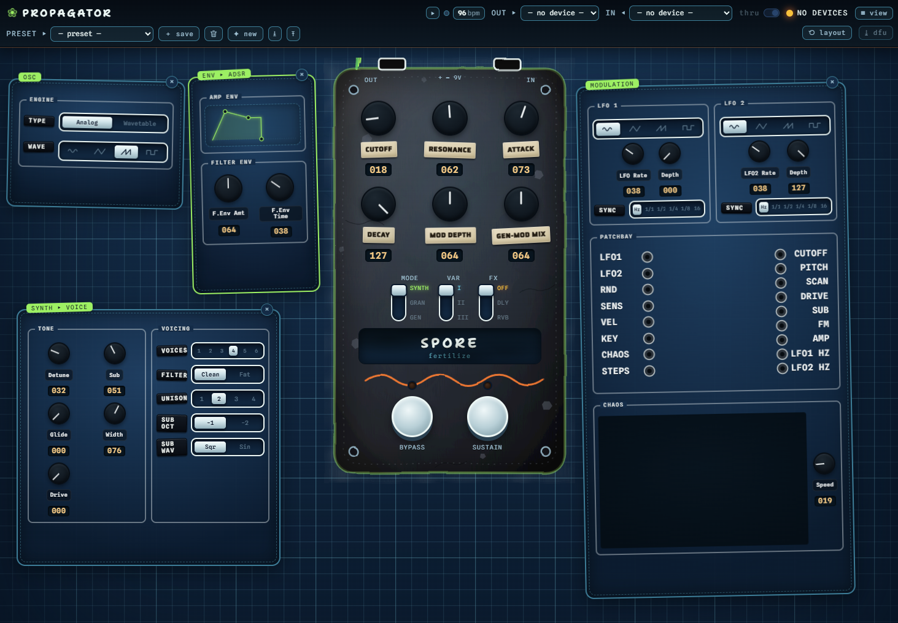

# 🌱 Propagator

[](https://github.com/rainybit-code/propagator/actions/workflows/web.yml)

A browser-based control surface for the **Spore** synthesizer (the Electrosmith
Daisy Seed firmware lives in the separate
[**`spore`**](https://github.com/rainybit-code/spore) repo). Configure Spore's
parameters live over USB MIDI - no install, no drivers.

**▶ Live: [`Propagator`](https://rainybit-code.github.io/propagator)** - open in Chromium based browser
with Spore connected over USB.



## Run it

Easiest: just open the **[live site](https://rainybit-code.github.io/propagator/)**.

To run locally for development - it's a static site, no build step:

```sh
# from repo folder
python -m http.server 8000
# then open http://localhost:8000 in Chrome or Edge
```

Use a **Chromium browser** (Chrome/Edge). Web MIDI needs a **secure context**, and
`localhost` counts - so serving over `http.server` is enough.
Safari has no Web MIDI; recent Firefox is partial.

## What it does

- Connects to Spore and other MIDI devices, shows live status.
- The 6 hardware **knobs** + 3 toggles + 2 footswitches,
  mirrored from the hardware.
- A full **Synth voice editor** in draggable "pods"
  oscillator engine (analog / wavetable), tone & voicing, an interactive **ADSR**
  graph, **LFO 1 / LFO 2**, a drag-to-wire **patchbay**, a piano-roll **step sequencer**,
  and a **tempo/clock** section
- Preset save/load (browser localStorage).
- **Firmware flashing in the browser** (WebUSB DFU) - the ⤓ dfu button opens a wizard
  that fetches the latest `spore` release `.bin` (or takes a local file), reboots Spore to
  the bootloader over MIDI (CC 118), and flashes the app to QSPI. An "install / repair
  bootloader (advanced)" toggle handles first-time setup (CC 119 → STM ROM → internal flash).
  The write address is auto-derived from the connected bootloader. Chrome/Edge; Windows needs
  WinUSB once (Zadig).

## MIDI map (the contract)

The CC / SysEx map is defined by the firmware and is the single source of truth:
see [**`spore/docs/MIDI_PROTOCOL.md`**](https://github.com/rainybit-code/spore/blob/main/docs/MIDI_PROTOCOL.md).
The mirror of it lives in the `CONFIG` block at
the top of `app.js` (labels, CC numbers, channel) - edit there to extend the surface.
Values are 0–127 (0..1 normalized).

## Files

```
index.html    structure + inline SVG filters (boil) and Spore chassis
styles.css    the living blueprint theme + animations
app.js        WebMIDI, pods/knobs/patchbay/sequencer/clock, presets, flash wizard
dfu.js        self-contained WebUSB + DfuSe firmware flasher
presets.json  factory preset library
```

## Contributing

See [`CONTRIBUTING.md`](CONTRIBUTING.md) — it's a static site (no build), formatted with
Prettier (4-space, 100-col, matching the Spore firmware repo) and enforced by CI. Run
`npx prettier --write .` before committing.

## License

**GPL-3.0-or-later.** Copyright (C) 2026 Joakim Langkilde. See [`LICENSE`](LICENSE).
Pairs with the **Spore** firmware ([`spore`](https://github.com/rainybit-code/spore) repo),
which is GPL-3.0 for the same reason.

## AI disclosure

In the interest of transparency: this project was built with substantial help from AI.
Code, documentation, and design were generated and iterated with **Claude** (Claude Code)
under human direction and review.
